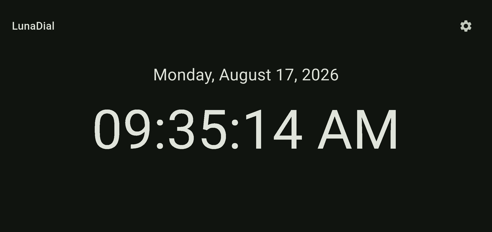
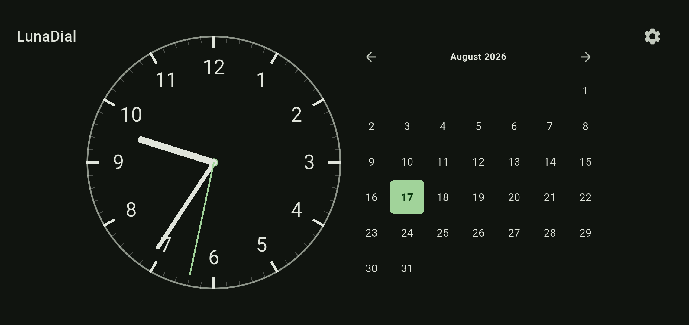
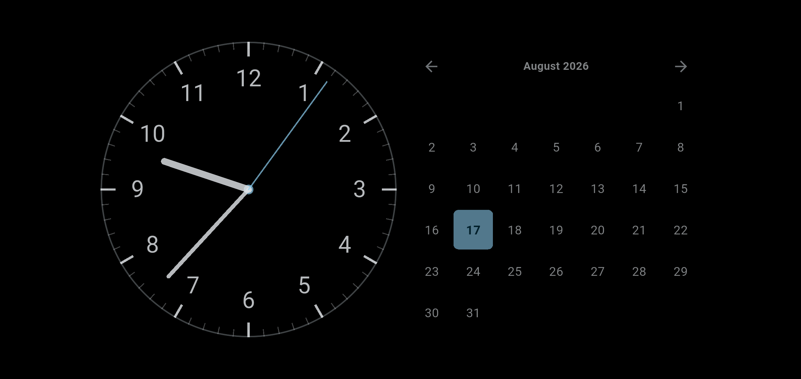
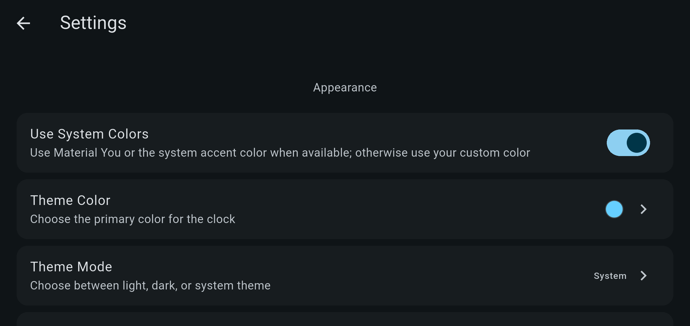

# LunaDial

LunaDial is a free, open-source clock app for phones, tablets, spare displays, and desktop computers. It is easy to read, uses few resources, and is comfortable to leave running.

<table>
  <tr>
    <td></td>
    <td></td>
  </tr>
  <tr>
    <td></td>
    <td></td>
  </tr>
</table>

## Download

- Android: Download the APK for your device from the [latest release](https://github.com/GT-610/lunadial/releases/latest). Most current phones use the `arm64-v8a` build.
- Windows: Download and extract `lunadial-windows-x64.zip` from the [latest release](https://github.com/GT-610/lunadial/releases/latest), then run `lunadial.exe`.
- Linux and macOS: Build LunaDial from source. Prebuilt packages are not currently available for these platforms.

## Features

- Digital and analog clocks, with an optional calendar
- 12- or 24-hour time, seconds, a second hand, and leading zeros
- Light, dark, or system appearance, with system, Material You, or custom accent colors
- A dimmer night display that you can enable manually, schedule, or follow the system theme
- An option to keep the screen awake and hide Android system controls
- Subtle periodic movement during extended night display to reduce OLED burn-in risk
- English and Simplified Chinese

## Privacy

LunaDial does not need network access and does not collect usage data. Your preferences stay on your device.

## Supported platforms

| Platform | Status |
|---|---|
| Android | Primary target. Android 6.0 (API 23) or newer |
| Windows | Supported. Packages are published with GitHub releases |
| Linux | Supported through source builds. A packaged release is planned |
| macOS | Best-effort support through source builds |
| Web | Available to build, but not a primary target |
| iOS | Not currently supported |

## Help and contributing

Found a problem or have an idea? Please [open an issue](https://github.com/GT-610/lunadial/issues). Contributions are welcome.

## License

LunaDial is licensed under the GNU General Public License v3.0. See [LICENSE](LICENSE) for details.
